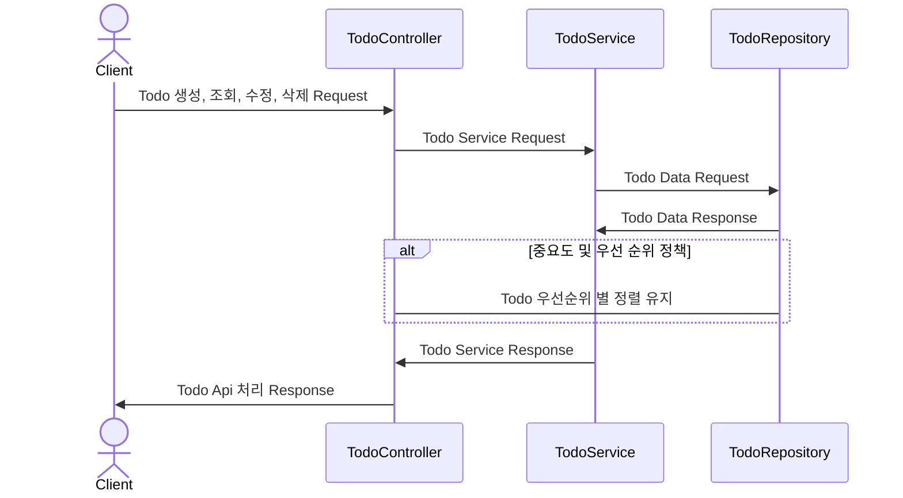
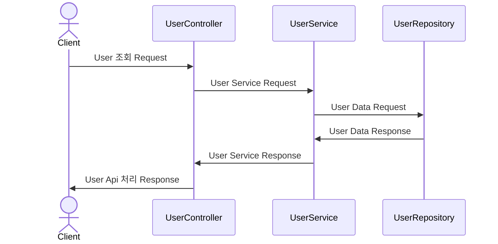

# Amorepacific Assignment (Todo Service Api)

## Requirements

- UserStory 를 만족하는 서버를 작성하세요. (UserStory는 설명 생략)
- Java 11, Gradle, Spring Boot 로 코딩 하세요. ( start.spring.io 에서 생성해서 시작하세요. )
- Database 를 사용하지 말고 자체 메모리에 저장하세요. 
- 어플리케이션 실행 중에 데이타가 유지되고, 종료하면 데이터가 지워집니다. 
- 가독성, 성능, 오류 발생 최소화 등을 고려하여 방어적으로 개발하세요. 
- 정상 동작하도록 디버깅 하세요.

## Environments

- **java 11**
- **gradle**
- **Spring boot 2.7.10**
- **docker**

## Project

### 개요

#### 1. Sequence-Diagram 

- 3 Tier Architecture 기반 Todo 처리 기준



- 3 Tier Architecture 기반 User 처리 기준



#### 2. Continuous Integration (CI) 전략

Continuous Integration 전략과 관련하여, 작은 사이즈의 과제이기 때문에 별도의 release 브랜치를 사용하지 않고, main branch 로만 사용한다.
Github Repository 및 Container Repository 를 바탕으로 소스코드와 docker image 를 산출물로 정의한다.
git command 와 git action workflow 를 통해, 산출물을 업로드 후 정식 확인이 된 이미지를 Local 환경 또는 다른 영역에 pull & run 하는 형태를 취하도록 한다.
아래의 그림과 같이 Continuous Integration 를 진행 한다.

```mermaid
flowchart TB
    subgraph Container Repository
        Package--command : docker pull & run-->Local-or-OtherZone
    end
    subgraph Repository
        Github--git action : workflow-->Package
    end
    subgraph dev
        Local --commad : git push origin main --tags-->Github
    end
```

## Usages

#### 1. Docker

###### Docker execute

```docker
docker pull ghcr.io/godlejr/amore-assignment:latest
```

```docker
docker run -p 8090:8080 ghcr.io/godlejr/amore-assignment:latest
```

#### 2. Api Document

###### Swagger UI

- Amorepacific Assignment API 명세서 정의
- 실질적인 Api 테스트 및 활용을 위함

```html
http://localhost:8090/api/docs
```

## Runtime Environment

- Amorepacific Assignment의 Runtime 환경 활용법
- 실질적인 사용 및 접근은 Usage 부분 참고를 권장

#### 1. build

```bash
./gradlew build #or sudo ./gradlew build
```

#### 2. cmd-execute

```bash
./gradlew bootRun #or sudo ./gradlew bootRun
```

#### 3. docker-execute

###### build

```bash
docker build -t assignment .
```

###### execute

```bash
docker run -p 8090:8080 assignment
```